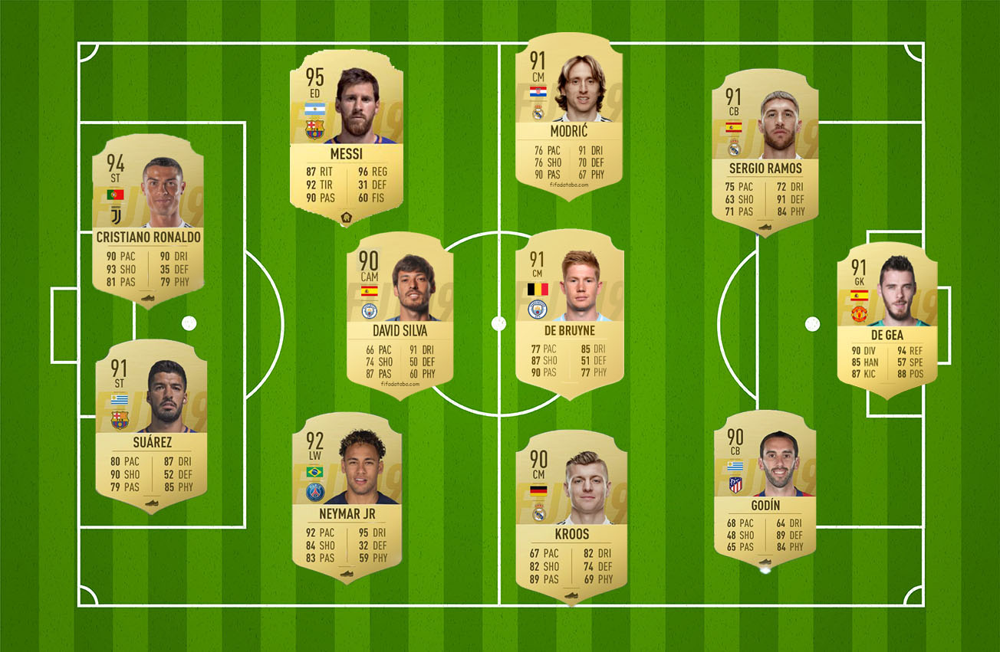

@import "../css/datavis.less"

```elm {l=hidden}
import Tidy exposing (..)
import VegaLite exposing (..)
```

# Undergraduate Coursework Template

# FIFA 19 Football Analysis

_By Fatme Kungyova_

Football is one of the most popular if not the most popular sports not only in Europe but around the world too! There are many theories which try to explain its origin, records are dating back to 2000 years ago when Chinese soldiers have been playing the game "Tsu'Chu" or "Kicking the ball". Later on, in the 9th Century, many people around England started playing a similar game to today's football!

In 1904 the famous FIFA (The Fédération Internationale de Football Association) was founded in Paris, France and laid the foundations of what we know as football today! It regulates the game and makes sure to keep the most favourite game to more than 500 million people around the world universal.

As a football fan, I cannot explain in words the feeling I get when I attend different games and watch my favourite sport! The emotions every fan experience are unexplainable but they make you jump up and down from happiness, shout, give directions to the footballers even if you know that they cannot hear you!

Many people stay on the shallow and do not deepen into the subject of football! What makes a team successful? What is needed to be a good footballer? What means the term "a good footballer"? There are many questions, which I will try to answer while analyzing the FIFA 2019 Dataset!

---

To start with the data analysis I first have to specify a set of questions, which should be answer to the end of this project, based on the dataset!

{(questions|}
Question 1: [Which age group performs better?](#which-age-group-performs-better)
Question 2:[What are the perfect ages for footballers in each position?](#what-are-the-perfect-ages-for-footballers-in-each-position)
Question 3:[What the perfect football team for 2019 would look like?](#what-the-perfect-football-team-for-2019-would-look-like)
Question 4:[Are younger footballers more aggressive during the game?](#are-younger-footballers-more-aggressive-during-the-game)
Question 5:[Are the teams with more young footballers performing better?](#are-the-teams-with-more-young-footballers-performing-better)
Question 6:[Are younger goalkeepers saving more goals?](#are-younger-goalkeepers-saving-more-goals)
Question 7:[Which footballers have the possibilities to become 'Excellent' players?](#which-footballers-have-the-possibilities-to-become-excellent-players)
{|questions)}

---

{(visualization|}

```elm {l=hidden}
data =
    dataFromUrl "data.csv"
```

To answer the first question, I set a few more questions, which will help me understand the data better.

## Which age group performs better?

- _Separate the players in 6 footballers' age groups: 15-20, 20-25, 25-30, 30-35, 35-40, 40-45!_
- _Compare the overall ratings of the players from every group._

This graph shows which country has the most footballers in the world.


This can be seen from both graphs.

> _A Word Cloud in the shape of football ball_

It is understandable that the players with English nationality dominate. England is the country, which is widely known as the home of football. It has also established the first football association - The Football Association (FA) in 1863. It's main idea is to create rules and to bring together all different codes, systems and tactics into one universal idea, which formed the modern football game! As a result, many football clubs were formed!

It is interesting to see from the graphs that most footballers come from countries that have amazing success in the football tournaments' history, organised by FIFA!
Germany is the second-best most successful nation in the FIFA World Cup, surpassed only by Brasil.
Spain has also had success in FIFA, by winning three tournaments in a row in 2008, 2010 and 2012!
Argentina has also won the FIFA World Cup in the 1978 and 1986!
It is intriguing to see that in the countries which have won the World Cup in the early ages of the tournament, football is the most or second-most popular sport in the country, which explains the high amount of footballers coming from them. In the majority of these countries, football has also been introduced by people travelled from England!

```elm {l=hidden v interactive highlight=6}
positionAgeCount123 : Spec
positionAgeCount123 =
    let
        cnfg =
            configure
                << configuration (coView [ vicoStroke Nothing ])
                << configuration (coAxis [ axcoTicks False, axcoDomain False, axcoLabelAngle 0 ])

        enc =
            encoding
                << position X
                    [ pName "Age"
                    , pNominal
                    , pBin []
                    , pScale [ scPaddingInner 0.3 ]
                    , pAxis [ axTitle "" ]
                    ]
                << position Y [ pAggregate opCount, pQuant, pAxis [ axTitle "", axValues (nums [ 3500 ]) ] ]
    in
    toVegaLite
        [ width 250
        , height 250
        , cnfg []
        , data []
        , enc []
        , bar [ maFillOpacity 0.6 ]
        ]
```

From the age groups that we have separated the footballers in, we can see that the number of players aged between 20 and 25 is the highest of all, following by the group of players between 25 to 30 years old.

The overall ratings are combinations of the six most important player's attributes! This is a score that can tell us which players had an excellent or very good performance during the year!

```elm {l=hidden v interactive highlight=6}
positionAgeCount12 : Spec
positionAgeCount12 =
    let
        cnfg =
            configure
                << configuration (coView [ vicoStroke Nothing ])
                << configuration (coAxis [ axcoTicks False, axcoDomain False, axcoLabelAngle 0 ])

        enc =
            encoding
                << position X
                    [ pName "Overall"
                    , pQuant
                    , pBin []
                    , pScale [ scPaddingInner 0.3 ]
                    , pAxis [ axTitle "" ]
                    ]
                << position Y [ pAggregate opCount, pQuant, pAxis [ axTitle "", axValues (nums [ 1000 ]) ] ]
                << color [ mName "Overall", mQuant, mLegend [] ]
                << column [ fName "Age", fNominal, fBin [] ]
                << tooltip [ tName "Overall", tQuant ]
    in
    toVegaLite [ cnfg [], data [], enc [], bar [] ]
```

We can see that most players with a score between 80 and 85 are among the age group 25 - 30, which means that their performance was 'Very Good'. The same is happening with the overall score between 85 and 90!
For 'Excellent' performance, the footballers should have a score higher than 90, we can see that such scores have footballers from the age groups 25 - 35! We can assume that the sportsmen between 25 and 35 years old have the best performance based on the FIFA 19 dataset!

The most popular positions are Striker (**ST**), Center Back (**CB**), Goalkeeper (**GK**), Center Midfielder (**CM**), Left Full-Back (**LB**), Right Fullback (**RB**), Right Mid Fielder (**RM**).

```elm {l=hidden v interactive highlight=6}
positionAgeCount : Spec
positionAgeCount =
    let
        enc =
            encoding
                << position X [ pName "Age", pQuant, pBin [] ]
                << position Y [ pAggregate opCount, pQuant ]
                << color [ mName "Position", mNominal, mLegend [] ]
                << column [ fName "Position", fNominal ]
    in
    toVegaLite [ data [], enc [], bar [] ]
```

We can also see that LB and RM are the positions of most players at the age of 22, while for the rest of the positions in the top 7, most of the footballers are 20 years old!


Every position has it's own requirements, from the graph under we can understand two things:

```elm {l=hidden v}
preferredFootCount : Spec
preferredFootCount =
    let
        cnfg =
            configure
                << configuration (coView [ vicoStroke Nothing ])
                << configuration (coAxis [ axcoTicks False, axcoDomain False, axcoLabelAngle 0 ])

        enc =
            encoding
                << position X
                    [ pName "Age"
                    , pNominal
                    , pBin []
                    , pScale [ scPaddingInner 0.3 ]
                    , pAxis [ axTitle "" ]
                    ]
                << position Y [ pAggregate opCount, pQuant, pAxis [ axTitle "", axValues (nums [ 3500 ]) ] ]
                << color [ mName "Preferred Foot", mNominal ]
    in
    toVegaLite
        [ width 250
        , height 250
        , cnfg []
        , data []
        , enc []
        , bar []
        ]
```

-The majority of footballers are aged between 20 and 25, which we already saw!
-The majority of footballers prefer their right foot!

There are only a few positions, where the preferred foot for the footballers is the left one, this is due to the fact that the majority of the population is right-handed and right-footed!
However, if left-footed footballer gets the ball on the left side of the pitch, he will create more problems for the defence of the opposite team. Similarly, a goalkeeper is usually more comfortable saving goals from the right side. Having a left-footed player in the positions LB and LM, for example, may become a benefit for the team and a problem for the opposition!

```elm {l=hidden v}
positionAgePreferredFoot : Spec
positionAgePreferredFoot =
    let
        enc =
            encoding
                << position X [ pName "Position", pNominal ]
                << position Y [ pName "Age", pNominal, pBin [] ]
                << color [ mName "Preferred Foot", mNominal ]
    in
    toVegaLite [ data [], enc [], bar [] ]
```

## What are the perfect ages for footballers in each position?

- _To answer this question, first we have to filter out all the positions in football!_
- _All the ages in these positions._
- _The overall scoring ratings._
- _Filtering the overall scores over 90, which means Excellent in the Rating Range for Quality!_

```elm {l=hidden highlight=[21-24,26-29]}
encHighlight =
    encoding
        << position X [ pName "Age", pNominal, pTitle "" ]
        << position Y [ pName "Position", pNominal ]
        << color
            [ mSelectionCondition (selectionName "mySelection")
                [ mName "Overall", mQuant ]
                [ mStr "black" ]
            ]
        << tooltip [ tName "Overall", tQuant ]
        << opacity
            [ mSelectionCondition (selectionName "mySelection")
                [ mNum 1 ]
                [ mNum 0.1 ]
            ]
```

The first graph for this question covers the first three actions in the 'to do' list! We can list all footballing position and all ages of footballers, then for every position, we can compare the colours which represent the overall score and see which age has the highest scores. From the first look, we can notice that highest overall rating for the position 'Center Forward (CF)' has 33 years old footballers.

```elm {l=hidden v interactive highlight=6}
positionAgeOverall : Spec
positionAgeOverall =
    let
        sel =
            selection
                << select "mySelection" seInterval [ seEncodings [ chX ] ]
    in
    toVegaLite
        [ width 440
        , data [] -- Data specified in code block above
        , encHighlight [] -- Encoding specified in code block above
        , bar []
        , sel []
        ]
```

This visualization gives better orientation on players of what ages would suit best the main positions on the football pitch!

> **Best player's age based on their overall scores!**  _The Image is showing players from which age groups have higher overall score based on the visualization "posAgeOverall"_

Surprisingly for me, for most of the positions, a better performance have players approximately 33 to 40 years old.

I have always thought that younger footballers, in the range 19 to 25 years old, have more energy and more passion for the game, therefore they will be better on the pitch than the rest of the players. However, the graphs so far proved me wrong!

## What the perfect football team for 2019 would look like?

- _Filter out the football players based on their positions._
- _Rank the footballers with higher overall ratings._
- _Create a team from the players with highest overall scores._

```elm {l=hidden v interactive}
sampleMap3 : Spec
sampleMap3 =
    let
        transAge =
            transform
                << filter (fiExpr "datum.Overall>= 90")

        enc =
            encoding
                << position X [ pName "Nationality", pNominal ]
                << position Y [ pName "Position", pNominal ]
                << size [ mName "Overall", mNominal ]
                << color [ mName "Club", mNominal ]
                << tooltip [ tName "Name", tNominal ]
    in
    toVegaLite [ width 400, height 300, transAge [], data [], enc [], circle [] ]
```

One more assumption that is refuted by the research is that English players will have the highest overall scores. Having in mind that the country with most footballers аround the globe is England, it does not appear to have footballers with 'Excellent' performance. In the same time, Spain has 3 footballers with over 90 overall ratings, regardless of the fact that football is the second most popular sport in the country.

```elm {l=hidden v interactive}
sampleMap2 : Spec
sampleMap2 =
    let
        transAge =
            transform
                << filter (fiExpr "datum.Overall >= 90")

        enc =
            encoding
                << position X [ pName "Club", pNominal ]
                << position Y [ pName "Name", pNominal ]
                << size [ mName "Overall", mNominal ]
                << color [ mName "Nationality", mNominal ]
                << tooltip [ tName "Position", tNominal ]
    in
    toVegaLite [ width 400, height 300, transAge [], data [], enc [], circle [] ]
```

Fourteen are the football players with 'Excellent' performance. However, they play in nine different football team. The teams with 2 or 3 'excellent' footballers are winners of the biggest tournaments organised by FIFA.

The perfect football team would look as follows:

> **The best team formed by players with overall over 90!**  _The best team in the World for 2019!_
> I would be very interested to watch a match in which this team plays!

We can confirm that the ultimate age for a footballer is the period between their 25 birthday to 35 years old.

```elm {l=hidden v interactive}
sampleMap34 : Spec
sampleMap34 =
    let
        transAge =
            transform
                << filter (fiExpr "datum.Overall >=90")

        enc =
            encoding
                << position X [ pName "Name", pNominal ]
                << position Y [ pName "Age", pQuant ]
                << size [ mName "Overall", mNominal ]
                << color [ mName "Club", mNominal ]
                << tooltip [ tName "Preferred Foot", tNominal ]
    in
    toVegaLite [ width 400, height 300, transAge [], data [], enc [], circle [] ]
```

> _This visualisation is created with photoshop based on the information from the previous graph!_

The top 14 footballers for FIFA 19 are all in this age group. Christiano Ronaldo and Leo Messi are both older than 30, due to which we can consider that the highest overall scores are achieved from footballers older than 30!

## Are younger footballers more aggressive during the game?

- _Separate the players in 6 age groups, similarly to the previous question!_
- _Compare their aggression scores._

Firstly, we separate the players in groups depending on their age. We can see that the same fashion follows for this question as well!

```elm {l=hidden v interactive highlight=6}
positionAgeCount1 : Spec
positionAgeCount1 =
    let
        cnfg =
            configure
                << configuration (coView [ vicoStroke Nothing ])
                << configuration (coAxis [ axcoTicks False, axcoDomain False, axcoLabelAngle 0 ])

        enc =
            encoding
                << position X
                    [ pName "Aggression"
                    , pQuant
                    , pBin []
                    , pScale [ scPaddingInner 0.3 ]
                    , pAxis [ axTitle "" ]
                    ]
                << position Y [ pAggregate opCount, pQuant, pAxis [ axTitle "", axValues (nums [ 1000 ]) ] ]
                --<< color [ mName "Position", mNominal, mLegend [] ]
                << column [ fName "Age", fNominal, fBin [] ]
    in
    toVegaLite [ cnfg [], data [], enc [], bar [ maFillOpacity 0.6 ] ]
```

The footballers with highest aggression rates are those aged between 25 and 35. Similarly to the assumption about the footballers' overall scores, we can conclude that footballers younger than 25 are actually less aggressive!

## Are the teams with more young footballers performing better?

- _Filter the football teams with a majority of younger footballers._
- _Rank their overall rating scores._
- _Compare the performance of the teams._

From the graph, we can see that not many football teams have players between 15 and 20 years old. Regardless of this fact, all six football teams are famous for their passion to win trophies.

```elm {l=hidden v interactive highlight=6}
positionAgeCount2 : Spec
positionAgeCount2 =
    let
        customData =
            transform
                << filter (fiExpr "datum.Overall >=80 && datum.Age >=15 && datum.Age <=20 ")

        enc =
            encoding
                << position X [ pName "Club", pNominal ]
                << position Y [ pName "Age", pQuant ]
                << color [ mName "Age", mQuant, mLegend [] ]

        --<< color [ mName "Position", mNominal, mLegend [] ]
        --  << column [ fName "Age", fNominal, fBin [] ]
    in
    toVegaLite [ data [], enc [], circle [], customData [] ]
```

There are significantly more football team with footballers in the age group 20 - 25.

```elm {l=hidden v interactive highlight=6}
positionAgeCount3 : Spec
positionAgeCount3 =
    let
        customData =
            transform
                << filter (fiExpr "datum.Overall >=80 && datum.Age >20 && datum.Age <=25 ")

        enc =
            encoding
                << position X [ pName "Club", pNominal ]
                << position Y [ pName "Age", pQuant ]
                << color [ mName "Age", mQuant, mLegend [] ]

        --<< color [ mName "Position", mNominal, mLegend [] ]
        --  << column [ fName "Age", fNominal, fBin [] ]
    in
    toVegaLite [ data [], enc [], circle [], customData [] ]
```

The majority of footballers in the teams are aged between 25 and 30, which is not a surprise!

```elm {l=hidden v interactive highlight=6}
positionAgeCount4 : Spec
positionAgeCount4 =
    let
        customData =
            transform
                << filter (fiExpr "datum.Overall >=80 && datum.Age >25 && datum.Age <=30 ")

        enc =
            encoding
                << position X [ pName "Club", pNominal ]
                << position Y [ pName "Age", pQuant ]
                << color [ mName "Age", mQuant, mLegend [] ]

        --<< color [ mName "Position", mNominal, mLegend [] ]
        --  << column [ fName "Age", fNominal, fBin [] ]
    in
    toVegaLite [ data [], enc [], circle [], customData [] ]
```

The situation is similar for the player older than 30 but younger than 35 years old.

```elm {l=hidden v interactive highlight=6}
positionAgeCount5 : Spec
positionAgeCount5 =
    let
        customData =
            transform
                << filter (fiExpr "datum.Overall >=80 && datum.Age >30 && datum.Age <=35 ")

        enc =
            encoding
                << position X [ pName "Club", pNominal ]
                << position Y [ pName "Age", pQuant ]
                << color [ mName "Age", mQuant, mLegend [] ]

        --<< color [ mName "Position", mNominal, mLegend [] ]
        --  << column [ fName "Age", fNominal, fBin [] ]
    in
    toVegaLite [ data [], enc [], circle [], customData [] ]
```

For those aged between 35 and 40, seems like there are no many opportunities for further career. Only 11 teams have footballers older than 35 and younger than 40!

```elm {l=hidden v interactive highlight=6}
positionAgeCount6 : Spec
positionAgeCount6 =
    let
        customData =
            transform
                << filter (fiExpr "datum.Overall >=80 && datum.Age >35 && datum.Age <=40 ")

        enc =
            encoding
                << position X [ pName "Club", pNominal ]
                << position Y [ pName "Age", pQuant ]
                << color [ mName "Age", mQuant, mLegend [] ]

        --<< color [ mName "Position", mNominal, mLegend [] ]
        --  << column [ fName "Age", fNominal, fBin [] ]
    in
    toVegaLite [ data [], enc [], circle [], customData [] ]
```

There are no football teams, which have footballers older than 40 years old.

```elm {l=hidden v interactive highlight=6}
positionAgeCount7 : Spec
positionAgeCount7 =
    let
        customData =
            transform
                << filter (fiExpr "datum.Overall >=80 && datum.Age >40 && datum.Age <=45 ")

        enc =
            encoding
                << position X [ pName "Club", pNominal ]
                << position Y [ pName "Age", pQuant ]
                << color [ mName "Age", mQuant, mLegend [] ]

        --<< color [ mName "Position", mNominal, mLegend [] ]
        --  << column [ fName "Age", fNominal, fBin [] ]
    in
    toVegaLite [ data [], enc [], circle [], customData [] ]
```

## Are younger goalkeepers saving more goals?

- _Filter out only the footballers with position 'Goalkeeper' or 'GK' as it is presented in the dataset._
- _Compare the number of saved penalties, based on the information we have in the dataset._
- _Compare the ages of the players with the highest number of saved penalties!_

The following visualization presents that the goalkeepers with the highest number of saved penalties are aged between the age of 20 and 35, which also confirms that the insights from the previous graphs are once again confirmed by the players with position 'Goalkeeper (GK)'.

```elm {l=hidden v interactive highlight=6}
penalties : Spec
penalties =
    let
        customData =
            transform
                << filter (fiExpr "datum.Overall >=80 && datum.Position =='GK' ")

        enc =
            encoding
                << position X [ pName "Penalties", pNominal ]
                << position Y [ pName "Age", pQuant ]
                << color [ mName "Penalties", mQuant, mLegend [] ]
                << tooltip [ tName "Name", tNominal ]

        --<< color [ mName "Position", mNominal, mLegend [] ]
        --  << column [ fName "Age", fNominal, fBin [] ]
    in
    toVegaLite [ data [], enc [], circle [], customData [] ]
```

In the following graphic visualization, we can compare the players' attributes for 'Very Good' and 'Excellent' goalkeepers from the FIFA 2019 dataset.


## Which footballers have the possibilities to become 'Excellent' players?

- _Filter the most important attributes for the 'Excellent' footballers._
- _Compute the average of those attributes._
- _Filter the footballers with higher average results than the average computed for the top 14 players._

Based on the FIFA cards, which show their most important attributes. I have chosen the main attributes, which will be computed to be: Acceleration, Agility, Aggression, Ball Control, Crossing, Dribbling, Finishing, Sprint Speed, Short Passing, Long Passing. Their average line was at 74, which established the decision point for 'good player'. Every player with average above 74 could become an 'Excellent' player.

Based on this, we can filter 23 footballers, which can be a good fit for every football team.


{|visualization)}

{(insights|}
All the questions that were set up at the beginning of this research were answered to a good extend! It is time to conclude what insights we have received from the data.
Firstly, I will start with the expectations that I had before starting the project.
As a football fan, I have always seen the passion of the younger players, by younger I mean, those who recently moved from the academy into the professional football, which is usually teenagers, or footballers younger than 25 years old!
I have always wondered what would happen if a football team had only teenage players or as I call them 'young' players. With this visualizations, I tried to answer my questions related to football!
At the very beginning of the project, I noticed that the majority of the footballers in the world are exactly the freshly graduated from the academy players. We can see that more than 6500 players are aged between 20 and 25. This, however, looks like a very good stage for the footballers to see and meet the professional football and the ones with the best potential to be sifted. We can see that with every year in football the young players are getting more experienced and their overall rates are going higher. It is easy to suppose that the big gap between the two age groups 25-30 and 30-35 is caused due to injuries and many footballers discontinue their careers. As a result, the age group 30-35 can be seen to have a low number of players with 'Fair', 'Poor' and 'Very Poor' overall ratings in comparison to the previous age groups. Even though the age group 30-35 is the third with most counts of records, it seems to be the best period of the career of the majority of the footballers!
With that analyze we answered the first question. Personally, I discovered that my assumption about the best period for a footballer's career is not their youth as I firmly believed before!
The most popular positions among the footballers are the most important positions on the pitch. The ones with higher responsibility rates. Undoubtedly, the most popular one is the one of a 'Striker', which can be explained with the fact that the most popular footballers are actually those that score goals. Many of the children's idols in this game are the Strikers - the ones that score the goals. The goalkeepers, that save the attempts for goals of the strikers of the opposite team. And of course, the Central Mid Fielder, which has the most important job beside the goalkeeper, being the leader of the team, following the formation to make sure that the communication between the team is maintained. I believe that the popularity of football positions is developed in childhood when the passion for this sport is born in the children's hearts.
Another insight that was interesting to me was the fact that there are no footballers in the FIFA 19 dataset, with 'Excellent' performance with English Nationality. There are many 'Very Good' players from England, but no one has overall over 90! A possible explanation for this is that many of the 'Very Good' players from England are in the age group 20-25, only the future will show whether England will have 'Excellent' players.
For me, there is no wonder why most of the football teams have footballers younger than 35 and older than 25.

The Data Visualization Dashboard is created with photoshop. The background photo is from my personal gallery!
{|insights)}

{(designJustification|}
The dataset, which I chose contains data close to my biggest passion - football. Constantly, I learn about this subject and the logic behind it, is of great interest of mine. In the beginning, I had a mental picture of a result, which I expected to receive from the project. However, when I started to create visualizations I followed the **Corum's** idea to 'let the data lead my design'.
I created a few hand-drawn sketches which helped me to distinguish what design I want to achieve.

For the results I got, I tried to find the logic behind the behaviour.
I decided to experiment with the approaches to design in my project.
That is why to decide what visualizations to create, I used Corum's approach.
**Tufte's** approach was something that I wanted to implement to some extent in this work, due to the fact that, the minimalist perspective makes the graph clearer, it allows easier comparison between the categories. Minimising the chart-junk is a way more effective to see the difference in the predominance of players with certain overall ratings in the age groups!
_I used the following graphs to visualize the data:_
**The Clustered Bar Chart** for comparison of the most important players' attributes
I chose The Clustered Bar Chart for comparison of the most important players' attributes because it allows regional comparison of secondary categorical division, while already divided into different primary categories.
**The histograms** were often used due to their representation of data and ease of comparison. They represent the frequency of estimations over classified values.
**A Treemap** was used in the representation of the most popular positions. In my opinion, it was the most suitable diagram since a treemap is an enclosed diagram that hierarchically displays how values for different categorical parts make a whole.
**Scatter plots** were also widely used in this work because they show a relationship between variables for different categories. It is easy to represent a lot of information with one, on first look, simple graph. In one case, I was able to show the names, nationalities, clubs, positions and overall scores of the players with a higher overall score than 90.
**A Pictogram** - it represents pictorial values for a primary category, with a secondary category division. In my case, the primary category breakdown was based on the age groups, while the secondary - on the overall scores.
**A Word Cloud**, which shows the frequency of words in the column 'Nationality' in the dataset!
{|designJustification)}

{(references|}

**Haroz, S., and Whitney, D.** (2012) How capacity limits of attention influence information visualization effectiveness. _IEEE Transactions on Visualization and Computer Graphics_, 18(12) pp.2402-2410.
**Andy Kirk** (2019) Data Visualisation. A Handbook for Data Driven Design. Pages 140-188.

{|references)}
